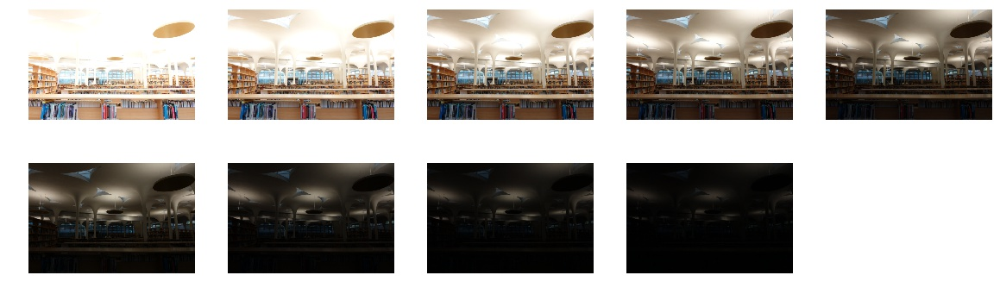

# VFX-HW1-HDR
### Introduction
* Given several different exposure images (LDR), use HDR recvoery algorithm to reconstruct high dynamic range photo. Then use tone mapping generate the final LDR image.

### Soure Code

  ./main.py: the main function to read all .ldr files and run HDR recovery, then finally tonemapping to .ldr
  
  ./PaulDebevec.py: The **Paul's Debevec**[1] HDR recovery algorithm
  
  ./Robertson.py: The **Robertson HDR**[2] recovery algorithm
  
  ./tonemapping.py: The **Photographic tone mapping**[3] of global operator and local operator(Dodging and burning)

### How to run
* ```python main.py [method] [imageSet] [scale]```
* method : "Paul" for PaulDebevec algorithm  , "Robertson" for Robertson algorithm
* imageSet: can be 1 , 2 or 3
* scale: scale the image to run faster

### Result
* Given images

* Result (PaulDebvec + Photographic global operator)


## Reference
[1] Paul E. Debevec, Jitendra Malik. Recovering High Dynamic Range Radiance Maps from Photographs, SIGGRAPH 1997.

[2] G. Ward. Fast Robust Image Registration for compositing High Dynamic Range Photographs from Hand-held Exposures, Journal of Graphics Tools, 2003.

[3] Erik Reinhard, Michael Stark, Peter Shirley, Jim Ferwerda, Photographics Tone Reproduction for Digital Images, SIGGRAPH 2002.
